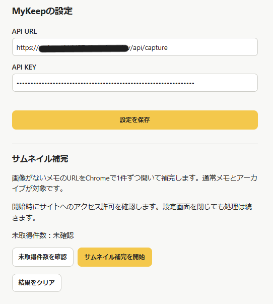

# MyKeep

日本語 | [English](README.en.md)

自分専用のシンプルなメモWebアプリです。Google Keepの代替用途として、メモ・URL・画像をPCやスマホから保存できます。

MyKeepは独立した個人向けアプリであり、Googleの公式製品ではありません。Google Keepとの関係は、Google Takeoutデータの移行対応です。

## スクリーンショット

### PC

広い画面では5列のMasonry表示。


### スマホ

スマホでは2列表示。


### Chrome拡張

現在のページをMyKeepへ保存。画像は旧UIで、現在はタイトル編集・ピン留め保存にも対応しています。


## 主な機能

- **メモ**：作成・編集・削除、URL保存、ピン留め、アーカイブ、色、チェックリスト、複数ラベル、タイトル・本文・URLの検索。
- **画像・添付**：複数画像の表示・削除、ファイル選択・Ctrl+V・ドラッグ＆ドロップ。JPEG / PNG / WebP / GIF / AVIF、1枚20MBまで。実体はR2へ保存し、一覧画像は遅延読み込み。保存済み添付画像やリンクサムネイルから、カードに表示する代表画像を選択できます。「自動」は従来の添付画像優先表示です。ImportではPDF等の添付にも対応。
- **一覧**：CSS Gridとカードの高さに応じたrow spanによるMasonry風表示。dense配置を使わず、各セクション内でDOM順と視覚順を左→右、上→下に維持。広いPC画面は5列、幅に応じて4〜3列、スマホは2列（300px以下は1列）。ピン留めと通常メモを分け、ヘッダーとPCのサイドバーはスクロールに追従。サイドバーには検索条件に影響されない各一覧・ラベルの総件数を表示。
- **絞り込み**：サイドバーでメモ・ピンあり・ピンなし・ラベルなし・画像なし・アーカイブ・ゴミ箱を切り替えます。各一覧内で検索でき、検索欄の「×」で検索文字だけをクリアできます。
- **リンク**：タイトル・説明・ドメイン・画像のリッチリンクプレビュー。取得できない場合は通常表示へフォールバック。
- **一括操作**：個別選択・全選択・全解除、一括アーカイブ・メモに戻す・ゴミ箱への移動・復元・完全削除・ラベル追加／解除、Undo。
- **ゴミ箱**：復元・完全削除、完全削除までの残り日数表示、ゴミ箱全件を空にする操作、7日経過後の自動完全削除。
- **ラベル管理**：作成・名前変更・複数削除。ラベルページは通常メモとアーカイブを横断して表示。
- **設定**：リッチリンクプレビュー、一覧カードのタイトル表示・本文表示、ダークモードのON / OFF、表示言語（日本語 / English。初期値は日本語、`localStorage`の`mykeep.language`に`ja` / `en`で保存）。表示中の自動更新。
- **Chrome拡張**：現在ページのタイトル・URL・メモ・ラベル・画像の保存、保存前のタイトル編集・ピン留め指定、Open Graph / Twitter Card取得、保存したメモをMyKeepで表示、サムネイル一括補完。
- **移行・バックアップ**：Google Keep Takeout ZIPのImport、JSON・Markdown・添付ファイルをまとめたZIP Export。
- **PWA**：iPhone・Android・PCでホーム画面やアプリとして起動。通信が必要です。

## アーキテクチャ

| 役割 | 使用技術 |
| --- | --- |
| Web画面 | React + Vite + TypeScript |
| API・静的ファイル配信・ゴミ箱掃除 | Cloudflare Worker |
| メモ・ラベル・チェックリスト・添付情報 | Cloudflare D1 |
| 画像・添付ファイルの実体 | 非公開のCloudflare R2 |
| Webのアクセス制御 | Cloudflare Access（メールOTP） |
| Chrome拡張 | Manifest V3 |
| PWA | Web App Manifest + 最小限のService Worker |
| ZIPの読込・生成 | ブラウザ内で処理（zip.js） |

## ローカルで起動

Node.js **22.12以上**とnpmを用意し、プロジェクトのルートで実行します。現在のVite / Wranglerの要件に合わせた最低バージョンです。

```sh
npm install
npm run db:local
npm run dev
```

表示されたローカルURLを開きます。`npm run dev` はビルド後、WranglerでWebとAPIを同じポートに公開します。D1 / R2はローカルで動作し、コード変更後は再起動が必要です。

Chrome拡張もローカルで試す場合は、Git管理外の `.dev.vars` に `CAPTURE_API_KEY=<自分で生成したキー>` を設定します。拡張のAPI URLは、ローカルURLに `/api/capture` を付けたものです（例：`http://127.0.0.1:8787/api/capture`）。

## GitHubからForkして使う

公開リポジトリを利用する場合は、**本家MyKeepを自分のGitHubアカウントへForkし、自分のForkをCloudflare Workers Buildsへ接続**してください。

本家MyKeep → 自分のGitHubへFork → 自分のCloudflare Workers Builds、という構成です。

1. 本家リポジトリの「Fork」から、自分のアカウントにコピーを作ります。
2. 自分のForkをローカルへ取得し、[ローカルで起動](#ローカルで起動)・[Cloudflareへデプロイ](#cloudflareへデプロイ)の手順で自分の環境を設定します。
3. 自動デプロイの接続先には、**本家ではなく自分のForkの `main`** を指定します。

作者が本家の `main` を更新しても、Forkには自動反映されません。自分のタイミングで更新を選べ、自分で加えた変更も維持できます（競合があれば解消が必要です）。本家を直接デプロイ元にせず、作者側の更新を自分の判断なしで本番へ反映しない運用を推奨します。

D1・R2・Cloudflare Access・`CAPTURE_API_KEY` は各自のCloudflare環境で用意・管理します。作者の環境とは別で、Forkしたこと自体で作者にメモ・画像・API KEYへのアクセス権が付く仕組みではありません。

## Cloudflareへデプロイ

### 初回設定

1. `npx wrangler login` で自分のCloudflareアカウントにログインします。
2. D1 `mykeep` とR2 `mykeep-images` の有無を確認します。存在する場合は再利用し、**存在しないリソースだけ**作成します。

   ```sh
   npx wrangler d1 create mykeep
   npx wrangler r2 bucket create mykeep-images
   ```

3. `wrangler.jsonc` の `database_id` を**自分のD1のIDへ置き換えます**。D1のbindingは `DB`、R2は `IMAGES`。名前を変更する場合は設定内の名前も合わせます。R2の公開アクセスは有効にしません。
4. 本番D1へ全マイグレーションを適用し、WebとWorkerをデプロイします。

   ```sh
   npx wrangler d1 migrations apply mykeep --remote
   npm run deploy
   ```

5. 32バイト以上の安全なランダム値をAPI KEYとして用意し、Worker Secretへ登録します。コマンドの入力欄へキーを入力してください。

   ```sh
   npx wrangler secret put CAPTURE_API_KEY
   ```

6. Cloudflare AccessでWebのホスト全体を保護し、メールOTPのみ・自分のメールアドレスだけを許可します。
7. 同じホストの **`/api/capture` だけ**を対象に、Accessのパス別アプリとBypassポリシーを設定します。通常画面・通常API・添付画像URLの保護は維持します。

Access保護とAPIキーなし／誤ったキーでの拒否を確認してから、個人データを保存してください。認証の役割は「セキュリティ」も参照してください。

### 継続デプロイ

現在の運用は **接続したGitHubリポジトリの `main` へのpush / merge → Cloudflare Workers Builds → 自動デプロイ**です。Fork利用者は**自分のForkの `main`** がトリガーになります。Cloudflare側で自分のForkを接続し、ビルドコマンドを `npm run build`、デプロイコマンドを `npx wrangler deploy` に設定します。

`npm run deploy` はビルドを含む手動デプロイ用です。**D1マイグレーションはpushやこれらのデプロイコマンドでは自動適用されません。** 新しいマイグレーションが追加された場合は、対応コードのデプロイ前に `npx wrangler d1 migrations apply mykeep --remote` を再実行してください。

ゴミ箱掃除のCronは `wrangler.jsonc` の `0 18 * * *`（毎日18:00 UTC／日本時間03:00）です。7日経過したメモは次の掃除で、R2の添付を削除してからD1のメモ・関連データを完全削除します。

## MyKeepを更新する

**本家に新しい更新があっても、ForkしたMyKeepは自動更新されません。** 利用者が「この更新を取り込む」と判断したときに、本家の変更をForkへ反映します。

1. 更新前に、READMEの変更、`migrations/` の新しいファイル、`wrangler.jsonc` の変更、Chrome拡張のバージョン／変更、自分の修正との競合を確認します。自分のD1 IDやR2設定を本家の値で上書きしないようにしてください。
2. 新しいmigrationがある場合は、まずその変更をローカルの作業ブランチへ取り込み、**Forkの `main` へ反映する前に**[継続デプロイ](#継続デプロイ)に記載した `npx wrangler d1 migrations apply mykeep --remote` を実行します。自動デプロイだけではD1は更新されません。
3. GitHubの「Sync fork」で差分を確認し、「Update branch」で更新できます。`main` を更新すると自動デプロイが始まるため、必要なmigration・設定の準備を済ませてから実行してください。競合や確認が必要な変更は作業ブランチ／Pull Requestで確認・解消してから `main` へ反映します。詳細は[GitHub公式のFork同期手順](https://docs.github.com/ja/pull-requests/how-tos/work-with-forks/syncing-a-fork)を参照してください。
4. **自分のForkの `main`** への反映後、Cloudflare Workers Buildsの結果を確認します。Chrome拡張に変更がある場合は、自分のローカルの `extension/` も更新し、Chromeで再読み込みします。

本家の更新を取り込む → 内容と必要なmigrationを確認・準備 → 自分のForkの `main` へ反映 → 自分のCloudflareへ自動デプロイ、という流れです。

## 基本的な使い方

- **作成**：ヘッダーの「＋ 新規メモ」からタイトル・本文・URLなどを入力して保存します。本文は初期3行で、縦にリサイズできます。
- **編集**：カードを開いて編集します。色付きマークによる色選択・ピン留め・アーカイブは横並びです。一覧では長文を省略しますが、保存データは切りません。メモタイトル3行・本文2行、リンクタイトル2行・説明3行が表示上限です。
- **画像**：新規・編集画面でファイル選択、Ctrl+V、ドラッグ＆ドロップが使えます。追加予定の画像はプレビューから取り消せます。新規メモではメモ保存後に画像を順番にアップロードします。
- **画像の拡大**：編集画面の保存済み画像をクリック／タップして拡大します。保存済みリンクサムネイルも添付画像の後ろに表示・拡大でき、「元画像を開く」からブラウザ標準の画像保存が使えます。複数画像は前後ボタンで切り替え、現在位置も表示します。PCでは左右キーで移動・Escapeで閉じる操作、スマホではスワイプ移動が使えます。
- **ピン／アーカイブ**：カード下部のボタンで切り替えます。ピン解除は5秒間表示される「取り消す」で戻せます。アーカイブしたメモはサイドバーの「アーカイブ」から開けます。
- **ピンなし**：サイドバーの「ピンなし」で、ピン留めされていない通常メモだけを表示します。アーカイブ・ゴミ箱は含まず、この一覧内で検索できます。
- **ピンあり／ラベルなし**：「ピンあり」はピン留めされた通常メモだけ、「ラベルなし」はラベルが1件もない通常メモだけを表示します。どちらもアーカイブ・ゴミ箱を除外し、一覧内で検索できます。
- **画像なし**：保存済みサムネイルも添付画像もない通常メモだけを表示します。ピン留めの有無は問わず、PDF等の非画像添付だけのメモも含みます。表示時に取得する動的リンクプレビュー画像は判定に使いません。
- **ゴミ箱**：編集画面の「ゴミ箱へ」などで移動します。添付も保持され、ゴミ箱で復元または完全削除できます。復元は元のアーカイブ状態を維持します。「ゴミ箱を空にする」で未読み込み分も含む全件を削除できます。完全削除は取り消せません。
- **検索**：ヘッダーの検索欄で、現在の表示条件内のタイトル・本文・URLをD1で部分一致検索します。右端の「×」で検索文字だけをクリアし、現在の一覧・ラベル条件は維持します。
- **ホーム／更新**：「MyKeep」で検索・ラベル条件を解除してメモへ戻ります。「↻」で現在のメモとラベルを再取得します。
- **設定**：ヘッダーの設定アイコンから「設定」「インポート」「エクスポート」を開きます。表示言語は日本語／Englishを即時に切り替えられ、初期値は日本語です。リッチリンク・タイトル表示・本文表示は初期ON、ダークモードは初期OFF。設定はブラウザのlocalStorageに保存します。タイトル／本文の切替は一覧カードだけに適用し、保存データや検索対象は変わりません。非表示にした分だけカードをコンパクトにし、内容が少なくても編集用のタップ領域は残します。
- **スマホ**：「☰」または一覧を左→右へスワイプして左ドロワーを開き、表示やラベルを切り替えます。ドロワー上を右→左へスワイプすると閉じます。一覧の最上部を下へ引くPull to Refreshで更新できます。

メモは50件ずつ読み込み、一覧の末尾付近へスクロールすると自動で追加します。編集したメモが更新日時順で先頭へ移動しても、見ていた周辺位置と読み込み済みページ数を維持します。画像の読み込みなど通常のカード高さ変化では、不要なスクロール位置の補正を行いません。

自動更新間隔は設定から10秒／30秒／60秒を選択でき、初期値は30秒です。画面が表示中のときだけ定期的に変更を確認し、バックグラウンドでは定期確認しません。フォーカス／再表示時にも確認するため、Chrome拡張から保存したメモも自動反映されます。

リッチリンクは保存済み情報を優先し、不足分をWorker経由の取得で補います。代表画像を「自動」にしている場合は添付画像を優先します。サイトのログイン要求やBot対策などで取得できない場合があり、全サイトのプレビューは保証しません。

## ラベル

- サイドバーのラベルを選ぶと、**通常メモ＋アーカイブ済みメモ**を表示します。ゴミ箱は除外します。
- 個別編集ではドロップダウンから複数選択し、チップの「×」で解除できます。「＋ 新規ラベルを作成」で入力した名前はメモ保存時に登録されます。
- サイドバー末尾の「ラベル整理」で、未使用ラベルも含めて新規作成・名前変更・複数削除ができます。一括ラベル追加画面でも新規作成できます。
- 各ラベル行の鉛筆ボタンから名前を変更します。全メモの関連付けを維持し、表示中のラベルページも変更後の名前へ追従します。変更先の別ラベルが既にある場合は拒否し、統合しません。
- 削除は確認後に実行します。対象ラベルを全メモから外しますが、メモ本体・画像・チェックリストは削除しません。

名前は前後の空白除去・Unicode NFC正規化・大文字小文字を区別しないキーで重複を判定します。ラベル名は1〜100文字、1メモにつき50件まで。チェックリストは1メモにつき500項目までです。

## 複数選択

1. ヘッダーの選択アイコン「☑」を押して選択モードに入ります。
2. カードをクリックして個別に選択・解除します。「全選択」「全解除」も使えます。
3. 下部の一括操作から、アーカイブ・メモに戻す・ゴミ箱・ラベル追加などを選びます。ラベルページでは「このラベルを外す」、ゴミ箱では復元・完全削除が使えます。
4. 終了後、対応する操作はSnackbarの「取り消す」で約5秒以内にUndoできます。完全削除はUndoできません。

**全選択の対象は画面に読み込まれているカードだけです。DB内の全件ではありません。** 一括操作の成功／失敗件数は約10秒で消えます。通常の画面エラーはこの自動消去の対象外です。

## Chrome拡張

現在の **MyKeep Capture v0.3.4** はChrome Manifest V3、Chrome 120以上に対応します。

### 読み込み・設定

1. Chromeで `chrome://extensions` を開き、デベロッパーモードを有効にします。
2. 「パッケージ化されていない拡張機能を読み込む」で、リポジトリ内の **`extension/` フォルダ全体**を選びます。
3. MyKeep Captureの「詳細」→「拡張機能のオプション」で、次を入力して「設定を保存」を押します。
   - API URL：`https://<your-worker>/api/capture`
   - API KEY：Worker Secretに登録した値
   - 表示言語：日本語 / English（初期値は日本語）。`chrome.storage.local.language`に`ja` / `en`で保存され、Web本体の言語設定とは独立しています。
4. MyKeepのホストへの接続許可を承認します。拡張のファイルを更新した場合は、利用するPC / MacのChromeで `chrome://extensions` を開いて再読み込みしてください。

API URL / API KEYは `chrome.storage.local` に保存されます。HTTPSが必要です（localhost / 127.0.0.1のローカル開発のみHTTP可）。

### 現在ページを保存

ツールバーのアイコンを押すと、現在ページのタイトル・URLを自動取得します。タイトルは保存前に自由に編集でき（最大300文字）、URLがあれば空欄でも保存できます。入力したタイトルを後から自動取得結果で上書きしません。

任意のメモ、登録済みラベル（複数・最大50件）、画像1枚を追加して保存できます。ラベル選択の右側にある「ピン留め」をONにすると、最初からピン留め状態で保存します。ポップアップを開いた時点ではOFFです。画像はCtrl+Vまたはファイル選択で追加し、対応形式・20MB上限はWebと同じです。

通常保存は `activeTab` を使い、現在ページのOpen Graph / Twitter Cardからタイトル・説明・画像・ドメインを取得します。取得できない場合もタイトル・URLで保存できます。ポップアップでは新規ラベルを作成しません。

保存後の「MyKeepで表示」は対象メモを新しいタブで開きます。Web側のCloudflare Accessログインは必要です。

## iPhone Safariから共有保存

iOSの「ショートカット」から、Safariで開いているページのタイトル・URLを保存できます。

1. 新しいショートカットを作り、詳細で「共有シートに表示」を有効にします。受け取る種類はSafariのWebページ／URLにします。
2. 「入力からURLを取得」で「ショートカットの入力」から共有ページのURLを取り出します。タイトルは共有ページの名前を使うか、「入力を要求」で入力します。
3. 「URLの内容を取得」を追加し、送信先を `https://<your-worker>/api/capture`、方法を **POST** にします。
4. ヘッダーへ `Authorization` を追加し、値を `Bearer <CAPTURE_API_KEY>` にします。`Bearer`の後には半角スペースを入れ、Worker Secretと同じキーを使います。
5. 要求本文は **フォーム** を選び、テキスト項目 `title`（タイトル・最大300文字）と `url`（共有ページのhttp / https URL・最大2000文字）を設定します。`title`は空文字でも構いませんが、項目自体は必要です。最後に「結果を表示」を追加すると保存結果を確認できます。

Safariの共有メニューからこのショートカットを選び、最初の実行時に自分のMyKeepへの接続を許可します。Content-Typeはショートカットに任せてください。APIは `application/x-www-form-urlencoded` と `multipart/form-data` の両方に対応し、JSON形式は受け付けません。画像を送る場合は従来のmultipart形式を使用します。

`/api/capture`だけをAccessのBypass対象にする既存設定を使います。API KEYを含むショートカットは公開・共有しないでください。ショートカットのAPI KEYには、Web本体のAccessログインとは別に保存APIへのアクセス権があります。

## Google Keep Import

1. Google TakeoutからGoogle KeepのZIPを取得します。
2. MyKeepの「⚙」→「Keep Import」でZIPを選びます。
3. メモ・添付それぞれの進捗と、成功・失敗・スキップ件数を確認します。「ゴミ箱として取込」はメモ成功件数の内数です。

ZIPとKeep JSONは**ブラウザ側で解析**し、ZIP全体をWorkerへ送信しません。メモと添付は1件ずつ送信し、1件の失敗で全体を停止しません。

取り込む内容：

- タイトル・本文・ピン・アーカイブ・作成日時・更新日時。
- `listContent` の項目テキスト・チェック状態・配列順、`labels[].name` のラベル。
- `attachments[].filePath` で対応するZIP内ファイルを照合し、画像・その他添付をR2へ保存。日本語・空白を含むファイル名にも対応。画像以外の添付はダウンロードできます。
- `annotations` の `source: "WEBLINK"` からHTTP(S) URLと `preview_title` / `preview_description` / `preview_hostname` を復元。本文全体がURLならそのURLを利用し、annotationがある場合は本文URLと一致する項目、なければ最初の有効な項目を優先。
- `isTrashed: true` のメモもゴミ箱へ取り込み、**Import時刻を `deleted_at` に設定**。そこから7日経過後の自動完全削除対象になります。

Importでは外部ページの取得を行わず、`preview_image` は空で取り込みます。Takeout由来の情報だけではサムネイルが不足するため、移行後の補完は**Chrome拡張のオプション画面から**次の[サムネイル補完](#サムネイル補完)を実行してください。Web一覧のリッチリンク表示だけでは、取得した画像URLがメモの保存済みサムネイルとして反映されない場合があります。

見つからない・空・20MB超の添付などはその添付だけスキップし、メモは残します。不正な個別チェック項目・ラベルは読み飛ばします。タイトル300文字・本文100,000文字・チェック項目500件・ラベル50件などの上限を超えるメモは失敗となります。重複判定や再インポート管理はなく、再実行するとメモが重複します。Google Keepの完全互換ではありません。

## サムネイル補完

Keep Import後などの、**`deleted_at IS NULL`・`preview_image` が空・HTTP(S) URLがあるメモ**が対象です。通常メモとアーカイブを含み、ゴミ箱は対象外です。

Chrome拡張がURLを**1件ずつバックグラウンドタブで開き**、`og:image` / `twitter:image` 等を読み取ってMyKeepへ保存します。画像URLと不足するプレビュー情報だけを補い、既存情報・本文・メモ更新日時は変えません。画像本体をR2へコピーする処理ではありません。

### 操作手順

`chrome://extensions` → MyKeep Capture →「詳細」→「拡張機能のオプション」の「サムネイル補完」を開きます。



1. API URL / API KEYを入力して「設定を保存」を押し、「未取得件数を確認」を押します。設定済みなら件数の確認から始めます。
2. 「サムネイル補完を開始」を押し、対象サイトへの追加アクセス許可を承認します。**通常保存の `activeTab` とは異なり、補完の開始・再開・再試行時にはHTTP(S)サイト全体への許可を要求します。**
3. 処理済み件数と成功／失敗件数を確認します。設定画面を閉じても処理は続きます。
4. 必要なら「一時停止」し、「続きから再開」で継続します。Chromeを終了した場合は、再起動後に手動で再開します。
5. 完了後、必要なら「失敗分だけ再試行」を押します。アクセス拒否・タイムアウト・画像なし等は失敗として残り、他のメモは続行します。
6. 履歴が不要なら「結果をクリア」を押します。処理中はクリア不可、一時停止中は「中止」してからクリアします。

補完後はMyKeepの「↻」で一覧を更新し、サムネイルが反映されたことを確認します。補完はメモの更新日時を変えないため、軽量自動更新では反映されない場合があります。サイトのログイン要求やアクセス制限などで画像を取得できない場合は、再試行しても補完できないことがあります。

1タブずつ処理し、大量のタブを同時に開きません。1000件以上を想定し、50件単位のcursor取得と `chrome.storage.local` の進捗保存で継続できる設計です。進捗はChromeプロファイルのローカル保存で、Googleサーバーへ同期しません。

「結果をクリア」は進捗・失敗履歴だけを初期化し、未取得件数を「未確認」へ戻します。API設定やMyKeepに保存済みのデータは消しません。次回は件数を再確認してください。画像が取得できないサイトは、クリア後も未取得対象に残ります。

## バックアップ / Export

「⚙」→「Export」で、メモ・アーカイブ・ゴミ箱を含む全データを取得し、**ブラウザで** `mykeep-backup-YYYY-MM-DD.zip` を生成します。メモは50件ずつ、添付は1件ずつ取得し、Workerで巨大ZIPを生成しません。

```text
mykeep-backup-YYYY-MM-DD.zip
├─ notes.json
├─ markdown/
│  ├─ note-000001.md
│  └─ ...
└─ attachments/
   └─ ID付きの一意なファイル名
```

`notes.json` は形式名・バージョン・エクスポート日時・メモ配列を持ち、各メモにID・タイトル・本文・URL・色・ピン・アーカイブ・ゴミ箱状態／日時・作成／更新日時・チェックリスト（状態・順序）・ラベル・添付情報・Markdownパスを含みます。保存済みの `preview_title` / `preview_description` / `preview_image` / `preview_hostname` と代表画像の選択 `card_image` も含みます。

Markdownは本文・URL・日時・状態・チェックリスト・ラベル・添付パスを人間が読める形式で保存します。R2の画像・PDF等は `attachments/` に入ります。画像をBase64でJSONへ埋め込みません。**外部プレビュー画像はURL情報のみで、画像本体はZIPに含みません。**

添付取得失敗時は可能な範囲で続行し、該当添付の `zip_path` は `null` になります。最後にメモ件数・添付成功／失敗件数を表示します。保存先を直接選べるブラウザではファイルへ順次書き込み、それ以外では完成ZIPをメモリ上のBlobとしてダウンロードします。大きなバックアップでは端末の空きメモリが必要です。

Export中は他のタブや端末でデータを変更しないでください。メモに付いていない未使用ラベルは出力対象外です。このZIPをMyKeepへ戻す復元Importや、Google Keepへの再インポート保証はありません。

## PWA

デプロイ済みのHTTPS URLを開き、Cloudflare Accessへログインしてから追加します。

- **iPhone**：Safariの共有メニューから「ホーム画面に追加」を選びます。「Webアプリとして開く」が表示される場合は有効にします。
- **Android**：Chromeのメニューからインストール／ホーム画面への追加を選びます。
- **PC**：対応ブラウザのアドレスバーやメニューのインストール操作を使います。通常のWebサイトとしても利用できます。

Manifestは `standalone` 表示を指定しています。Service Workerは画面遷移をネットワークから取得する最小構成で、メモデータや画像をオフライン用にキャッシュしません。利用には通信が必要です。

## セキュリティ

- **Web本体**：Cloudflare Accessでホスト全体を保護します。通常APIと添付画像URLも対象です。Access設定はCloudflare側で行う必要があり、通常APIには独自のログイン処理がありません。
- **拡張用API**：Access Bypassは `/api/capture` だけに限定します。このパスの保存・ラベル取得・サムネイル補完はすべて `Authorization: Bearer <CAPTURE_API_KEY>` で認証します。キー未設定は503、不正／未送信は401です。`/api/*` 全体をBypassにしないでください。
- **API KEY**：32バイト以上のランダム値を推奨。Worker Secretに登録し、コード・`wrangler.jsonc`・D1・READMEへ実値を書かず、Gitへcommitしないでください。
- **ローカル設定**：`.env*` / `.dev.vars*` は `.gitignore` 対象です。拡張のキーはChromeプロファイル内の `chrome.storage.local` に保存されます。
- **R2**：非公開のまま使用します。添付はAccessで保護したWorker経由で配信します。外部サイトのリッチリンク画像は、そのサイトのURLから読み込まれます。

## Issue / Pull Request

本家GitHubのIssueでは、不具合報告・セットアップで詰まった点・改善提案・機能提案を受け付けます。バグ修正・README修正・改善コードのPull Requestも歓迎します。報告には再現手順や利用環境を添え、API KEY・Secret・個人データは載せないでください。

MyKeepは個人開発プロジェクトです。IssueやPull Requestは歓迎しますが、返信・修正・採用・mergeや対応時期を保証するものではありません。

### Contributing方針

- Pull Requestは自動で本家の `main` へ入りません。内容を確認し、merge・修正依頼・保留・closeする場合があります。
- DB構造・認証方式・Cloudflare構成・UIの大幅変更や大きな新機能は、実装前にIssueで相談してください。
- PR作成後に本家の `main` が更新され、同じ箇所の変更が競合する場合があります。その際は最新の本家 `main` をPR側へ取り込み、競合解消をお願いすることがあります。

## ディレクトリ構成

```text
src/              React画面、Import / Export、リンクプレビュー
worker/           Worker API、プレビュー取得、Cronによるゴミ箱掃除
extension/        MyKeep Capture（popup・options・background）
public/           PWA Manifest、アイコン、Service Worker
migrations/       D1の全マイグレーション
wrangler.jsonc    Worker・D1・R2・Cron設定
package.json      開発・ビルド・デプロイ用コマンド
```
